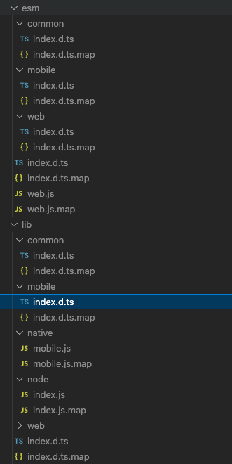

# Packemon Mobile Web Test

This repo shows that the "types" field is incorrectly set for platform `native` and using subpaths.

The generated `exports` looks like:

```json
{
  "exports": {
    "./package.json": "./package.json",
    "./mobile": {
      "react-native": {
        "types": "./lib/native/mobile/index.d.ts", <==== This is incorrect
        "default": "./lib/native/mobile.js" <==== This is incorrect
      },
      "default": "./lib/native/mobile.js" <==== This is incorrect
    },
    "./web": {
      "browser": {
        "types": "./esm/web/index.d.ts",
        "module": "./esm/web.js",
        "import": "./esm/web.js"
      }
    },
    ".": {
      "node": {
        "types": "./lib/node/index.d.ts",
        "default": "./lib/node/index.js"
      },
      "default": "./lib/node/index.js"
    }
  }
}
```

The generated files look like:


Run:
```shell
yarn build && yarn validate
```
